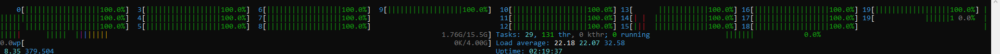
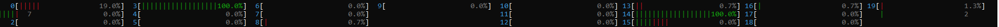
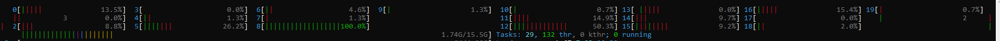

# Context Switching vs. Migration: when threads switch execution (context switch) vs. when they move between CPU cores (migration) and how voluntary/involuntary switches happen.
# Thread Pinning & Load Balancing: Explored why threads sometimes stay on the same core despite load imbalance and how Linux avoids unnecessary migrations to reduce cache misses.
# Monitoring Tools: Used pidstat, perf, taskset, and numactl to track context switches, migrations, and CPU affinity.



```cpp
#include<iostream>
#include<thread>
#include<vector>
#include<chrono>
#include<sched.h>
std::vector<std::thread> threads;
void Func(){
    long long int cnt=0;
    std::cout<<"trying to initialize a thread"<<threads.size()<<std::endl;
    while (true)
    { 
    }
    std::cout<<"thread created\n";
}
int main(){
    long long int cnt=0;

    while(cnt++<10000){
        try {
            std::cout<<"going to create thread "<<threads.size()<<std::endl;
            std::thread t1(Func);
            threads.emplace_back(std::move(t1));
        } catch (const std::system_error& e) {
            std::cerr << "Thread creation failed: " << e.what() << std::endl;
        } 
    }
    for (auto& t : threads) {
        t.join();
    }
    return 0;
}
```
// this will consume all the threads


# used one fullcore in main and one full in child thread

```cpp
#include<iostream>
#include<thread>
#include<vector>
#include<chrono>
#include<sched.h>
std::vector<std::thread> threads;
void Func(){
    long long int cnt=0;
    std::cout<<"trying to initialize a thread"<<threads.size()<<std::endl;
    while (true)
    { 
        // std::cout<<std::hash<std::thread::id>()(std::this_thread::get_id())<<" "<<sched_getcpu() <<"     "<<threads.size()<<std::endl;
    }
    std::cout<<"thread created\n";
}
int main(){
    long long int cnt=0;

    while(cnt++<1){
        try {
            std::cout<<"going to create thread "<<threads.size()<<std::endl;
            std::thread t1(Func);
            threads.emplace_back(std::move(t1));
        } catch (const std::system_error& e) {
            std::cerr << "Thread creation failed: " << e.what() << std::endl;
        } 
    }
    while (true)
    {
        /* code */
    }
    
    for (auto& t : threads) {
        t.join();
    }
    return 0;
}
```
# used one fullcore in main and one semi idle in child thread

```cpp
#include<iostream>
#include<thread>
#include<vector>
#include<chrono>
#include<sched.h>
std::vector<std::thread> threads;
void Func(){
    long long int cnt=0;
    std::cout<<"trying to initialize a thread"<<threads.size()<<std::endl;
    while (true)
    { 
         std::cout<<std::hash<std::thread::id>()(std::this_thread::get_id())<<" "<<sched_getcpu() <<"     "<<threads.size()<<std::endl;
    }
    std::cout<<"thread created\n";
}
int main(){
    long long int cnt=0;

    while(cnt++<1){
        try {
            std::cout<<"going to create thread "<<threads.size()<<std::endl;
            std::thread t1(Func);
            threads.emplace_back(std::move(t1));
        } catch (const std::system_error& e) {
            std::cerr << "Thread creation failed: " << e.what() << std::endl;
        } 
    }
    while (true)
    {
        /* code */
    }
    
    for (auto& t : threads) {
        t.join();
    }
    return 0;
}
```
 migrations can still happen in these. one core is semi idle as  ```cpp std::cout<<std::hash<std::thread::id>()(std::this_thread::get_id())<<" "<<sched_getcpu() <<"     "<<threads.size()<<std::endl;``` is a I/O operation and thrad goes to waiting stage while this, keeping cpu idle, however context switch can happen here if cpu thinks I/O can take time.

# Virtual Memory
 A memory management technique where the OS uses a combination of RAM and disk space to provide applications with more memory than physically available. uses hash sort of thing. virtual memory -> actual memory.

# Swap Memory
Swap Memory: A portion of the disk used as an extension of RAM when physical memory is full, allowing inactive pages to be moved to disk to free up space.

