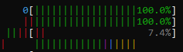

# context can switch anytime, so prefer pinning the threads to a specific core.

## Context Switching vs. Migration: when threads switch execution (context switch) vs. when they move between CPU cores (migration) and how voluntary/involuntary switches happen.
## Thread Pinning & Load Balancing: Explored why threads sometimes stay on the same core despite load imbalance and how Linux avoids unnecessary migrations to reduce cache misses.
## Monitoring Tools: Used pidstat, perf, taskset, and numactl to track context switches, migrations, and CPU affinity.


```cpp
#include<iostream>
#include<thread>
#include<vector>
#include<chrono>
#include<sched.h>
std::vector<std::thread> threads;
void Func(){
    long long int cnt=0;
    std::cout<<"trying to initialize a thread"<<threads.size()<<std::endl;
    while (true)
    { 
    }
    std::cout<<"thread created\n";
}
int main(){
    long long int cnt=0;

    while(cnt++<10000){
        try {
            std::cout<<"going to create thread "<<threads.size()<<std::endl;
            std::thread t1(Func);
            threads.emplace_back(std::move(t1));
        } catch (const std::system_error& e) {
            std::cerr << "Thread creation failed: " << e.what() << std::endl;
        } 
    }
    for (auto& t : threads) {
        t.join();
    }
    return 0;
}
```
// this will consume all the threads


# used one fullcore in main and one full in child thread (harccore while loop)

```cpp
#include<iostream>
#include<thread>
#include<vector>
#include<chrono>
#include<sched.h>
std::vector<std::thread> threads;
void Func(){
    long long int cnt=0;
    std::cout<<"trying to initialize a thread"<<threads.size()<<std::endl;
    while (true)
    { 
        // std::cout<<std::hash<std::thread::id>()(std::this_thread::get_id())<<" "<<sched_getcpu() <<"     "<<threads.size()<<std::endl;
    }
    std::cout<<"thread created\n";
}
int main(){
    long long int cnt=0;

    while(cnt++<1){
        try {
            std::cout<<"going to create thread "<<threads.size()<<std::endl;
            std::thread t1(Func);
            threads.emplace_back(std::move(t1));
        } catch (const std::system_error& e) {
            std::cerr << "Thread creation failed: " << e.what() << std::endl;
        } 
    }
    while (true)
    {
        /* code */
    }
    
    for (auto& t : threads) {
        t.join();
    }
    return 0;
}
```
# used one fullcore in main and one semi idle in child thread

```cpp
#include<iostream>
#include<thread>
#include<vector>
#include<chrono>
#include<sched.h>
std::vector<std::thread> threads;
void Func(){
    long long int cnt=0;
    std::cout<<"trying to initialize a thread"<<threads.size()<<std::endl;
    while (true)
    { 
         std::cout<<std::hash<std::thread::id>()(std::this_thread::get_id())<<" "<<sched_getcpu() <<"     "<<threads.size()<<std::endl;
    }
    std::cout<<"thread created\n";
}
int main(){
    long long int cnt=0;

    while(cnt++<1){
        try {
            std::cout<<"going to create thread "<<threads.size()<<std::endl;
            std::thread t1(Func);
            threads.emplace_back(std::move(t1));
        } catch (const std::system_error& e) {
            std::cerr << "Thread creation failed: " << e.what() << std::endl;
        } 
    }
    while (true)
    {
        /* code */
    }
    
    for (auto& t : threads) {
        t.join();
    }
    return 0;
}
```
 migrations can still happen in these. one core is semi idle as  ```cpp std::cout<<std::hash<std::thread::id>()(std::this_thread::get_id())<<" "<<sched_getcpu() <<"     "<<threads.size()<<std::endl;``` is a I/O operation and thrad goes to waiting stage while this, keeping cpu idle, however context switch can happen here if cpu thinks I/O can take time.


## To avoid all migrations and context switches, just pin the threads to a specific core.
```cpp
#include <iostream>
#include <thread>
#include <vector>
#include <sched.h>
#include <unistd.h>

std::vector<std::thread> threads;

void Func(int core_id) {
    // Set thread affinity (pin to a core)
    cpu_set_t cpuset;
    CPU_ZERO(&cpuset);
    CPU_SET(core_id, &cpuset);
    sched_setaffinity(0, sizeof(cpu_set_t), &cpuset); // Pin thread to a core

    while (true) {
        std::cout << "Thread ID: " << std::hash<std::thread::id>()(std::this_thread::get_id()) 
                  << " on Core: " << sched_getcpu() 
                  << " | Total Threads: " << threads.size() 
                  << std::endl;
        usleep(500000); // Reduce printing rate (500ms)
    }
}

int main() {
    long long int cnt = 0;
    int num_cores = std::thread::hardware_concurrency(); // Get number of cores

    while(cnt < 10) { // Create 10 threads
        try {
            std::cout << "Creating thread " << cnt << std::endl;
            std::thread t1(Func, cnt % num_cores); // Assign core cyclically
            threads.emplace_back(std::move(t1));
            cnt++;
        } catch (const std::system_error& e) {
            std::cerr << "Thread creation failed: " << e.what() << std::endl;
        }
    }

    for (auto& t : threads) {
        t.join();
    }

    return 0;
}
```

# Virtual Memory
 A memory management technique where the OS uses a combination of RAM and disk space to provide applications with more memory than physically available. uses hash sort of thing. virtual memory -> actual memory.

# Swap Memory
Swap Memory: A portion of the disk used as an extension of RAM when physical memory is full, allowing inactive pages to be moved to disk to free up space.


## 100% core usage does not mean its consuming 100% if the actual physical cores was free. i.e. % usage can be subjective. Depends wheher the actual physical is free or not. I have pinned two threads at the same physical core.




```cpp
#define _GNU_SOURCE
#include <iostream>
#include <thread>
#include <vector>
#include <sched.h>
#include <unistd.h>

// Function to pin a thread to a specific CPU
void pinThreadToCPU(int cpu) {
    cpu_set_t cpuset;
    CPU_ZERO(&cpuset);
    CPU_SET(cpu, &cpuset);
    sched_setaffinity(0, sizeof(cpu_set_t), &cpuset);
}

// CPU-bound function that runs indefinitely
void busyLoop(int cpu_id) {
    pinThreadToCPU(cpu_id); // Pin to the specified logical CPU
    std::cout << "Thread " << std::this_thread::get_id() << " running on CPU " << cpu_id << std::endl;
    while (true) {
    } // Infinite loop
}

int main() {
    // Change these values to two logical cores of the same physical core
    int cpu1 = 0; // Logical core 1
    int cpu2 = 1; // Logical core 2 (same physical core as cpu1)

    std::thread t1(busyLoop, cpu1);
    std::thread t2(busyLoop, cpu2);

    t1.join();
    t2.join();

    return 0;
}```

This C++ program creates two threads running infinite loops (while(true) {}) and pins them to two logical cores of the same physical core using sched_setaffinity().
Since both threads are CPU-bound, they compete for execution resources due to Hyper-Threading, but no preemptive context switching happens unless another high-priority task is scheduled. In Hyper-Threading, both logical cores run simultaneously, sharing execution units dynamically at the hardware level without OS involvement.
