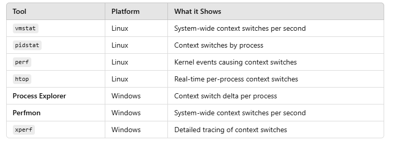
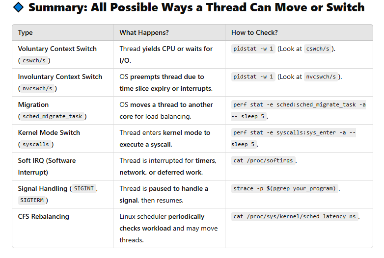

htop

# thread monitoring commands

# types of context switch and how to monitor them

pidstat -w 1
perf stat -e sched:sched_migrate_task -a -- sleep 5
perf stat -e syscalls:sys_enter -a -- sleep 5
